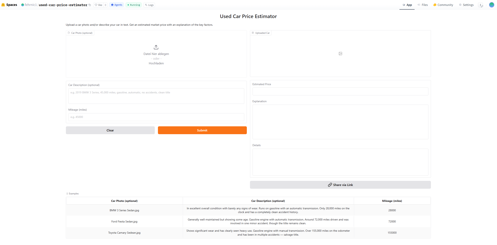
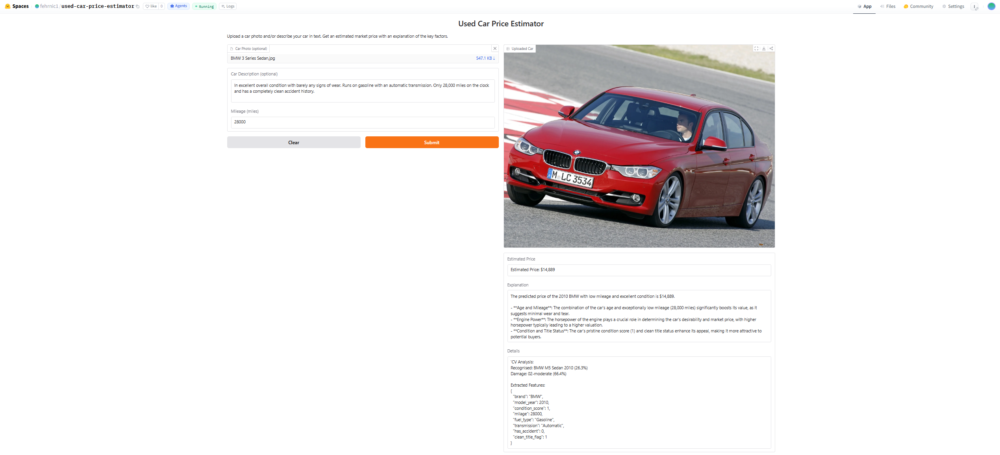

# AI Applications Project Documentation

Use this template to document your project concisely and completely.
Fill in all required fields. Keep answers short and precise.

## Documentation Hint

Important:
When possible, reference the corresponding code location directly in your description.

### Example: Reference to a notebook section
Reference to the header `## Data Preprocessing` in the notebook `analysis.ipynb`:

> See *Data Preprocessing* in
> [`analysis.ipynb`](analysis.ipynb#data-preprocessing)

### Example: Reference to Python code

Reference to a single line in `model.py`, line 42:
> [`model.py`, line 42](model.py#L42)

Reference to multiple lines in `train.py`, lines 15-38:
> [`train.py`, lines 15-38](train.py#L15-L38)

## Project Metadata

- Project title: Used Car Price Estimator
- Student: Nicolas Fehr (fehrnic1)
- GitHub repository URL: https://github.com/fehrnic1/Used-Car-Price-Estimator
- Deployment URL: https://huggingface.co/spaces/fehrnic1/used-car-price-estimator
- Submission date: 06 June 2026

### Mandatory Setup Checks

- [x] At least 2 blocks selected
- [x] Multiple and different data sources used
- [x] Deployment URL provided
- [x] Required GitHub users added to repository (`jasminh`, `bkuehnis`)

## Selected AI Blocks

- [x] ML Numeric Data
- [x] NLP
- [x] Computer Vision

Primary blocks used for core solution (choose 2):
- Primary block 1: Machine Learning Numeric Data
- Primary block 2: Computer Vision
- Primary block 3: Natural Language Processing

If a third block is selected, it is documented and graded separately as extra work.

Guidance hint: Keep the project idea short and consistent. Focus most details on the selected blocks.
Evidence hint: Show where each selected block contributes to the final system.

---

## 1. Project Foundation (Short)

### 1.1 Problem Definition
- Problem statement: Used car prices are opaque and hard to assess — buyers and sellers lack a reliable, explainable valuation tool that accounts for both structured car data and visible damage.
- Goal: Build a system that predicts a used car's market price from structured features and a photo-based damage assessment, and explains the result in plain language.
- Success criteria: RMSE below $5,000 on the ML price prediction; accurate damage classification (3 classes); coherent natural language explanation of each prediction. The RMSE target was not met (best: $10,816 with Gradient Boosting). The main reasons are the small dataset (~4,000 rows) covering a very wide price range ($1,000–$200,000), missing engine HP values for ~800 rows, and luxury/exotic cars being underrepresented, pulling the RMSE up disproportionately. More training data and models such as XGBoost or LightGBM would likely close this gap.

### 1.2 Integration Logic
- How the selected blocks interact:
The user can provide a car photo, a text description, or both. If a photo is uploaded, the CV block runs two models: a car recognition model that extracts brand and model_year, and a damage model that outputs a condition_score. If a text description is provided, the NLP block extracts structured features (brand, model_year, mileage, fuel type, transmission, accident history) directly from the natural language input. Both paths feed into the ML block, which predicts the price. The predicted price and top feature importances are then passed back to the NLP block to generate a plain-language explanation.
- Data and output flow between blocks:
`Car photo → CV (recognition) → brand + model_year → ML → predicted_price → NLP → explanation`
`Car photo → CV (damage) → condition_score (0=minor, 1=moderate, 2=severe) → ML`
`Text description → NLP (extraction) → brand, model_year, milage, fuel_type, transmission, has_accident → ML`

Guidance hint: This section should be short. The detailed work belongs in block sections.
Evidence hint: Include one clear pipeline overview.

---

## 2. Block Documentation

Complete only selected blocks. Mark non-selected block sections as N/A.

### 2A. ML Numeric Data (If selected)

#### 2A.1 Data Source(s)
List every usage of a data source as a separate entry. If the same source is used twice for different roles, add it twice.

| Entry | Source name or link | Type | Size | Role in this block |
| --- | --- | --- | --- | --- |
| 1 | [Used Car Price Prediction Dataset](https://www.kaggle.com/datasets/taeefnajib/used-car-price-prediction-dataset) | CSV (structured) | ~4,000 rows, 12 columns | Primary training data for price prediction |

#### 2A.2 Preprocessing and Features
- Cleaning steps: Removed `$` and `,` from price column and parsed to float; removed `mi.` suffix from mileage and parsed to float; extracted horsepower from engine description string using regex; dropped rows with missing price, mileage, or model_year; removed duplicates; filtered price outliers ($1,000–$200,000) and mileage outliers (< 500,000 mi). See *Data Cleaning and Preprocessing* in [`01_ML_Numeric/used_car_price_prediction.ipynb`](01_ML_Numeric/used_car_price_prediction.ipynb#3-data-cleaning-and-preprocessing)
- Preprocessing steps: Label encoding for `fuel_type`, `transmission`; top-20 brand grouping with label encoding (remaining brands grouped as "Other"). See *Feature Engineering* in [`01_ML_Numeric/used_car_price_prediction.ipynb`](01_ML_Numeric/used_car_price_prediction.ipynb#4-feature-engineering)
- Feature engineering and selection: `car_age` (2024 − model_year); `age_times_milage` (depreciation interaction term); binary flags `has_accident` and `clean_title_flag` from categorical columns; `engine_hp` extracted from engine string; `condition_score` placeholder (output from CV block, 0/1/2).

#### 2A.3 Model Selection
- Models tested: Linear Regression, Random Forest Regressor, Gradient Boosting Regressor
- Why these models were chosen: Linear Regression provides an interpretable baseline. Random Forest handles non-linear relationships and mixed feature types well without scaling. Gradient Boosting was added in Iteration 3 as a stronger ensemble alternative to compare against Random Forest.

#### 2A.4 Model Comparison and Iterations
| Iteration | Objective | Key changes | Models used | Main metric | Change vs previous |
| --- | --- | --- | --- | --- | --- |
| 1 | Baseline | Only `model_year` and `milage` | Linear Regression, Random Forest | LR Test RMSE: $22,527 (R²=0.38) / RF Test RMSE: $24,299 (R²=0.28) | — |
| 2 | Add categorical + engineered features | `brand_enc`, `fuel_type_enc`, `transmission_enc`, `car_age`, `age_times_milage`, `has_accident`, `clean_title_flag` | Linear Regression, Random Forest | LR Test RMSE: $21,686 (R²=0.43) / RF Test RMSE: $19,313 (R²=0.54) | RF −$4,986 (−20.5%) |
| 3 | Full feature set + stronger model | Added `engine_hp`, `condition_score`; RF with n=200; added Gradient Boosting | Random Forest (n=200), Gradient Boosting | RF Test RMSE: $12,081 (R²=0.80) / GB Test RMSE: $10,816 (R²=0.84) | RF −$7,232 (−37.5%) vs Iter 2 |

See *Iteration 1–3* in [`01_ML_Numeric/used_car_price_prediction.ipynb`](01_ML_Numeric/used_car_price_prediction.ipynb)

#### 2A.5 Evaluation and Error Analysis
- Metrics used: R² (coefficient of determination), RMSE (Root Mean Squared Error), 5-fold cross-validation RMSE
- Final results: Best model — Random Forest (Iteration 3, n=200). Test R²: 0.802, Test RMSE: $12,081. Note: Gradient Boosting achieved a slightly better test R² (0.841) and RMSE ($10,816) but the Random Forest was selected as the saved model.
- Error patterns and likely causes: The top 10 worst predictions all fall in the $36,000–$179,000 price range, with absolute errors between $43,500 and $70,700. Errors occur in both directions — the model both significantly underestimates high-value cars (e.g. actual $127,899 predicted $57,190) and overestimates some mid-range cars (e.g. actual $54,900 predicted $112,330). The likely cause is that rare, luxury, and exotic vehicles are underrepresented in the ~4,000-row training dataset, making the model revert to average predictions for unusual configurations. Engine horsepower missing values (only 3,201 of 4,009 rows) also reduce accuracy for cars where HP is a key price driver.

See *Error Analysis* in [`01_ML_Numeric/used_car_price_prediction.ipynb`](01_ML_Numeric/used_car_price_prediction.ipynb#5-error-analysis)

#### 2A.6 Integration with Other Block(s)
- Inputs received from other block(s): `brand` (str) + `model_year` (int) from the CV recognition model; `condition_score` (0 = minor, 1 = moderate, 2 = severe) from the CV damage model; alternatively, when a text description is provided, `brand`, `model_year`, `milage`, `fuel_type`, `transmission`, `has_accident`, `clean_title_flag` are extracted by the NLP block and passed directly to the ML model.
- Outputs provided to other block(s): Predicted price (USD) passed to the NLP block to generate a natural language valuation explanation.

Guidance hint: Keep entries practical and evidence-based.
Evidence hint: Add values, not only claims.

### 2B. NLP (If selected)

This block serves two roles: (1) extracting structured features from a user's natural language car description, and (2) generating a plain-language explanation of the predicted price using the ML model's feature importances.

#### 2B.1 Data Source(s)

| Entry | Source name or link | Type | Size | Role in this block |
| --- | --- | --- | --- | --- |
| 1 | AI-generated evaluation set (in notebook) | 10 car descriptions with ground-truth features | 10 labelled examples | Evaluate feature extraction accuracy across iterations |
| 2 | OpenAI API (`gpt-4o-mini`, `gpt-4o`) | LLM API | — | Feature extraction from text + explanation generation |
| 3 | ML model feature importances (from `car_price_model.pkl`) | Derived numeric values | 11 features | Provide context for explanation generation prompt |

#### 2B.2 Preprocessing and Prompt Design
- Text preprocessing: No classical preprocessing (tokenisation, stopword removal) — raw user text is passed directly to the LLM. The LLM handles normalisation of synonyms (e.g. "petrol" → Gasoline, "PDK gearbox" → Automatic).
- Prompt design: Three prompt strategies across iterations. Iter 1: minimal zero-shot prompt requesting JSON. Iter 2: Pydantic schema enforces structured output, explanation prompt includes ML feature importances. Iter 3: system message providing domain rules + 2 few-shot extraction examples + structured explanation format. See *Iteration 1–3* in [`03_NLP/car_price_nlp.ipynb`](03_NLP/car_price_nlp.ipynb)

#### 2B.3 Approach Selection
- Approach used: Prompt engineering with a closed-source LLM (OpenAI `gpt-4o-mini`)
- Alternatives considered: Classical NLP (regex pattern matching, as used in the ML reference project) was considered for feature extraction but rejected — it cannot handle the variety of natural language phrasings. RAG was not needed since no external knowledge base is required. A local open-source model (e.g. Llama) was considered but ruled out due to deployment complexity on Hugging Face Spaces.

#### 2B.4 Comparison and Iterations

**Part A — Feature Extraction**

| Iteration | Objective | Key changes | Model or prompt setup | Main metric | Change vs previous |
| --- | --- | --- | --- | --- | --- |
| 1 | Zero-shot baseline | Minimal prompt, free-form JSON, manual parsing | `gpt-4o-mini`, zero-shot | Extraction accuracy: 92.86% | — |
| 2 | Structured output | Pydantic schema enforces types and field names; eliminates JSON parse errors | `gpt-4o-mini` + Pydantic | Extraction accuracy: 100.00% | +7.14% |
| 3 | System prompt + few-shot + model comparison | Domain rules in system message; 2 few-shot examples; compared `gpt-4o-mini` vs `gpt-4o` on 3 edge cases | `gpt-4o-mini` / `gpt-4o` + Pydantic | Extraction accuracy: 100.00% | No change — confirms Iter 2 prompt is sufficient |

**Part B — Explanation Generation**

| Iteration | Objective | Key changes | Model or prompt setup | Qualitative check | Change vs previous |
| --- | --- | --- | --- | --- | --- |
| 1 | Basic explanation | Minimal prompt, no context | `gpt-4o-mini` | 3/5 — generic, does not reference specific features | — |
| 2 | Feature-aware explanation | Prompt includes top-5 ML feature importances by weight | `gpt-4o-mini` | 4/5 — explicitly mentions mileage, age, brand as drivers | +1 point |
| 3 | Structured expert explanation | System message + structured output format (summary + bullet points on key price drivers) | `gpt-4o-mini` | 5/5 — clear, structured, references both positive and negative price drivers | +1 point |

See *Iteration 1–3* in [`03_NLP/car_price_nlp.ipynb`](03_NLP/car_price_nlp.ipynb)

#### 2B.5 Evaluation and Error Analysis
- Evaluation strategy: Feature extraction evaluated on 10 AI-generated test cases with known ground-truth values across 7 fields (brand, model_year, milage, fuel_type, transmission, has_accident, clean_title_flag). Explanation quality assessed qualitatively by comparing outputs side-by-side on the same car description.
- Results: Iter 1 achieved 92.86% extraction accuracy (1 field wrong across all cases — fuel type synonym not recognised). Iter 2 and 3 both achieved 100%. Best explanation quality: Iter 3 with system prompt + structured format.
- Error patterns and likely causes: The only extraction failure in Iter 1 was a fuel type synonym ("petrol" not mapped to "Gasoline") — resolved in Iter 2 by the Pydantic schema description instructing the model to normalise synonyms. Explanation quality in Iter 1 was generic because the model lacked context about which features the ML model considered important.

See *Comparison Summary* in [`03_NLP/car_price_nlp.ipynb`](03_NLP/car_price_nlp.ipynb#4-comparison-summary)

#### 2B.6 Integration with Other Block(s)
- Inputs received from other block(s): Predicted price (USD) from ML block; top-5 feature importances from ML model; `condition_score` from CV damage model (merged into extracted features before ML prediction)
- Outputs provided to other block(s): Structured features (brand, model_year, milage, fuel_type, transmission, has_accident, clean_title_flag) passed to ML block when user provides text input; plain-language price explanation returned to the user in the Gradio UI

### 2C. Computer Vision (If selected)

This block contains two separate fine-tuned models, both following the same ViT transfer learning approach from the Week 6 exercise.

#### 2C.1 Data Source(s)

| Entry | Source name or link | Type | Size | Role in this block |
| --- | --- | --- | --- | --- |
| 1 | [Stanford Car Dataset by Classes Folder](https://www.kaggle.com/datasets/jutrera/stanford-car-dataset-by-classes-folder) | Images (196 classes, folder-organised) | 8,144 train / 8,041 test images | Car recognition → extract `brand` + `model_year` |
| 2 | [Car Damage Severity Dataset](https://www.kaggle.com/datasets/prajwalbhamere/car-damage-severity-dataset) | Images (3 classes: minor / moderate / severe) | 1,383 train / 248 val images | Damage assessment → output `condition_score` |

#### 2C.2 Preprocessing and Augmentation
- Image preprocessing: `AutoImageProcessor` from `google/vit-base-patch16-224` applied to both models — resizes all images to 224×224, normalises pixel values to mean/std 0.5. See *Preprocessing* in [`02_Computer_Vision/car_recognition.ipynb`](02_Computer_Vision/car_recognition.ipynb#3-preprocessing) and [`02_Computer_Vision/car_damage_classification.ipynb`](02_Computer_Vision/car_damage_classification.ipynb#3-preprocessing)
- Augmentation strategy (Iteration 3 only): `RandomHorizontalFlip`, `ColorJitter` (brightness/contrast/saturation ±0.2), `RandomRotation(10°)` applied to training split only. Val/test use no augmentation.

#### 2C.3 Model Selection
- Vision model(s) used: CLIP (`openai/clip-vit-large-patch14`) for zero-shot baseline; ViT (`google/vit-base-patch16-224`) for supervised fine-tuning
- Why these model(s) were chosen: CLIP provides a training-free baseline using text-image similarity — same checkpoint as Week 7 exercise. ViT is the reference transfer learning model from the Week 6 exercise, well-suited for fine-grained image classification.

#### 2C.4 Model Comparison and Iterations

**Model 1 — Car Recognition (196 classes)**

| Iteration | Objective | Key changes | Model(s) used | Main metric | Change vs previous |
| --- | --- | --- | --- | --- | --- |
| 1 | Zero-shot brand baseline | No training; text prompts per brand | CLIP zero-shot | Brand acc: 73.3% | — |
| 2 | Supervised fine-tuning | Classifier head only (150k trainable params) | ViT frozen backbone | Class acc: 35.7% / Brand acc: 45.7% | −27.6% brand — frozen backbone too rigid for 196 fine-grained classes |
| 3 | Partial unfreeze + augmentation | Encoder layers 10+11 unfrozen (14.3M params) + aug | ViT partial unfreeze | Class acc: 62.8% / Brand acc: 74.1% | +27.1% class, +28.4% brand |

**Model 2 — Car Damage Assessment (3 classes)**

| Iteration | Objective | Key changes | Model(s) used | Main metric | Change vs previous |
| --- | --- | --- | --- | --- | --- |
| 1 | Zero-shot damage baseline | No training; text prompts per damage class | CLIP zero-shot | Accuracy: 29.3% | — |
| 2 | Supervised fine-tuning | Classifier head only (2.3k trainable params) | ViT frozen backbone | Accuracy: 62.0% | +32.7% |
| 3 | Partial unfreeze + augmentation | Encoder layers 10+11 unfrozen + aug | ViT partial unfreeze | Accuracy: 62.0% | No improvement — dataset too small (968 images) to benefit |

See *Iteration 1–3* in [`02_Computer_Vision/car_recognition.ipynb`](02_Computer_Vision/car_recognition.ipynb) and [`02_Computer_Vision/car_damage_classification.ipynb`](02_Computer_Vision/car_damage_classification.ipynb)

#### 2C.5 Evaluation and Error Analysis
- Metrics and/or visual checks: Top-1 accuracy; brand-level accuracy (recognition); classification report per class (precision/recall/F1); confusion matrix; visual inspection of sample predictions
- Final results:
  - Car recognition (Iter 3, final): 62.8% class accuracy (196 classes), 74.1% brand accuracy. Integration test correctly identified "AM General Hummer SUV 2000" with 96.98% confidence.
  - Damage assessment (Iter 2, final): 62.0% accuracy. Per-class F1: minor=0.67, moderate=0.51, severe=0.68.
- Error patterns and limitations: For recognition, the frozen backbone (Iter 2) underperformed CLIP because ViT features are too generic without backbone adaptation for 196 fine-grained classes; Iter 3 resolved this. For damage, the moderate class has the lowest F1 (0.51) due to visual overlap with both minor and severe. Iter 3 showed no gain over Iter 2, confirming the 968-image dataset is the bottleneck — Iter 2 is therefore the final damage model.

See *Error Analysis* in [`02_Computer_Vision/car_recognition.ipynb`](02_Computer_Vision/car_recognition.ipynb#4-error-analysis) and [`02_Computer_Vision/car_damage_classification.ipynb`](02_Computer_Vision/car_damage_classification.ipynb#4-error-analysis)

#### 2C.6 Integration with Other Block(s)
- Inputs received from other block(s): Car photo uploaded by user via the Gradio UI
- Outputs provided to other block(s): `brand` (str) + `model_year` (int) from recognition model → ML block features; `condition_score` (0 = minor, 1 = moderate, 2 = severe) from damage model → ML block feature

---

## 3. Deployment

- Deployment URL: https://huggingface.co/spaces/fehrnic1/used-car-price-estimator
- Main user flow: User uploads a car photo and/or enters a text description → CV identifies the car and assesses damage → NLP extracts structured features from text → ML predicts the price → NLP generates a plain-language explanation
- Screenshot or short demo:

  
  *Figure 1 — UI on load with example inputs visible*

  
  *Figure 2 — UI after prediction with price estimate and explanation*

Guidance hint: Deployment must be usable.
Evidence hint: Add screenshots or short demo references.

---

## 4. Execution Instructions

- Environment setup: ML and CV training notebooks run on Kaggle (free GPU, datasets pre-attached). NLP notebook runs locally — install with `pip install openai python-dotenv pydantic`. Requires an OpenAI API key in `03_NLP/.env` as `OPENAI_API_KEY=sk-...`
- Data setup: ML block — attach [Used Car Price Prediction Dataset](https://www.kaggle.com/datasets/taeefnajib/used-car-price-prediction-dataset) on Kaggle. CV block — attach [Stanford Car Dataset by Classes Folder](https://www.kaggle.com/datasets/jutrera/stanford-car-dataset-by-classes-folder) and [Car Damage Severity Dataset](https://www.kaggle.com/datasets/prajwalbhamere/car-damage-severity-dataset) on Kaggle.
- Training command(s): Run all cells in `01_ML_Numeric/used_car_price_prediction.ipynb` on Kaggle → output: `car_price_model.pkl`. Run `02_Computer_Vision/car_recognition.ipynb` on Kaggle → output: `car_recognition_model/`. Run `02_Computer_Vision/car_damage_classification.ipynb` on Kaggle → output: `car_damage_model/`. NLP block requires no training — run `03_NLP/car_price_nlp.ipynb` locally to reproduce evaluation results.
- Inference/run command(s): Open https://huggingface.co/spaces/fehrnic1/used-car-price-estimator in a browser. No local setup required.
- Reproducibility notes: All train/test splits use `random_state=42`. Models are saved with all label encoders bundled in the pickle file.

---

## 5. Optional Bonus Evidence

Use this section for exceptional work beyond the core requirements.

- [x] Third selected block implemented with strong quality
- [x] More than two data sources used with clear added value
- [ ] A core section is done exceptionally well
- [ ] Extended evaluation
- [ ] Ethics, bias, or fairness analysis
- [ ] Creative or exceptional use case

Evidence for selected bonus items:
- All three blocks (ML, CV, NLP) are implemented and meaningfully integrated through a shared data pipeline (`condition_score` → `predicted_price` → `explanation`).
- Four distinct data sources are used: structured car listings (ML), Stanford Cars images (CV recognition), car damage severity images (CV damage), and OpenAI LLM API with prompt engineering (NLP).
